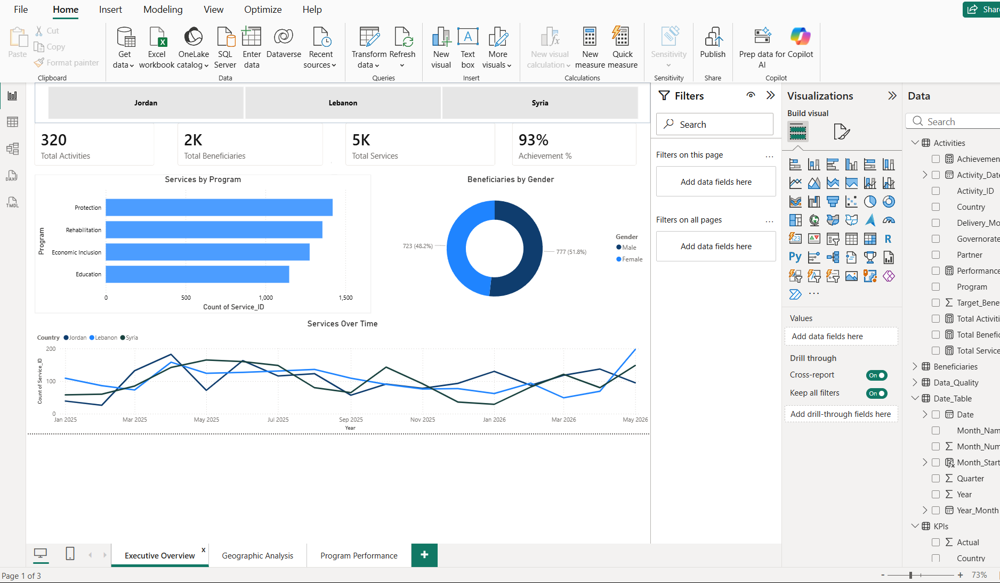
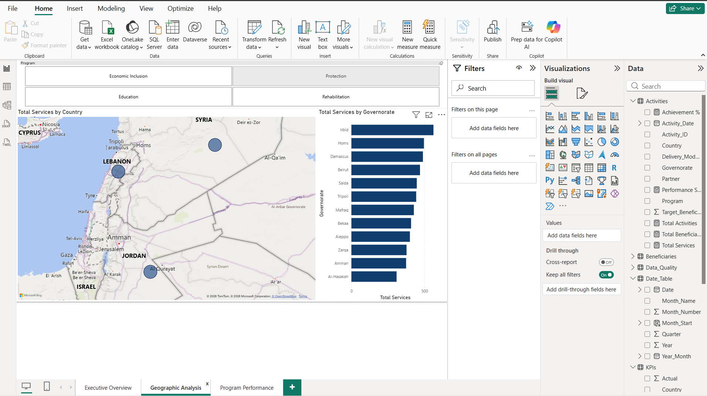
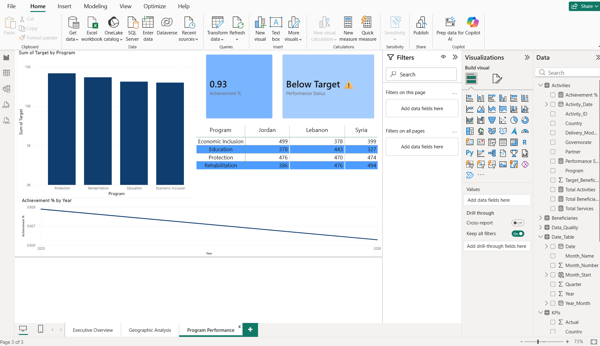
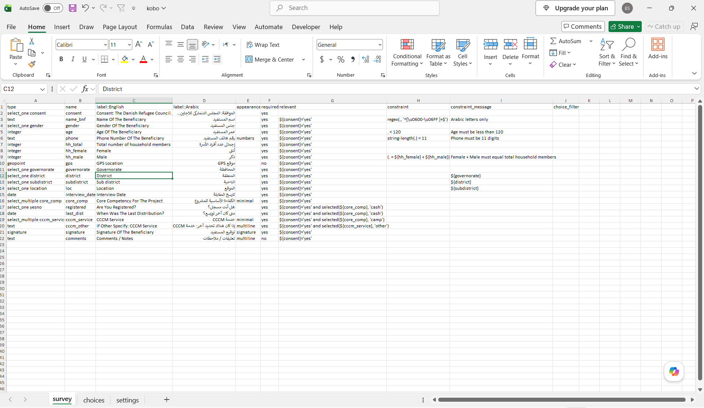
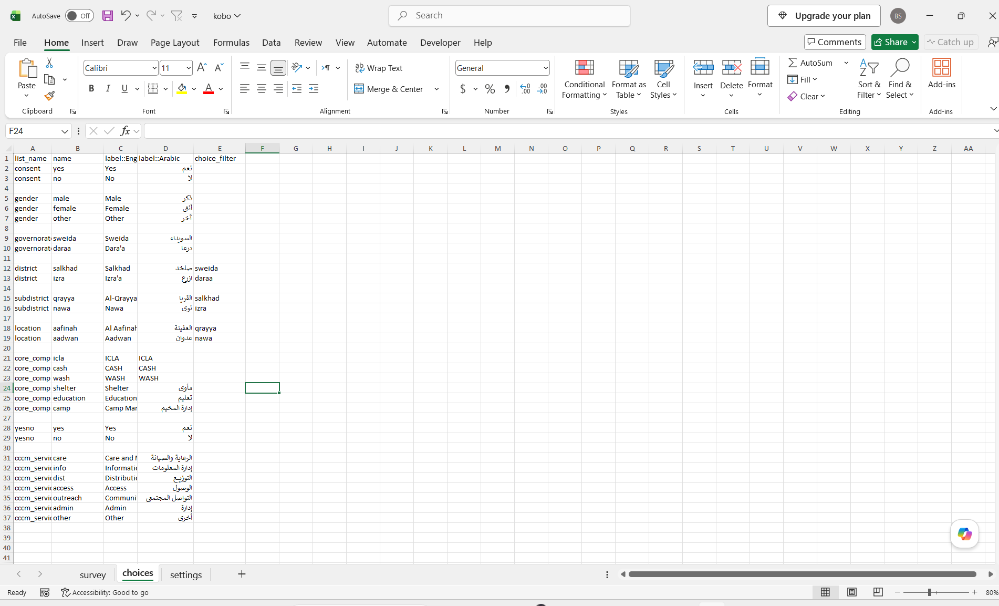

# Contoso Data Analytics Dashboard

## 📊 Overview
This project demonstrates a data analytics dashboard built using simulated Contoso data.

## 🎯 Objective
Transform raw data into actionable insights to support decision-making.

## 🛠 Tools Used
- Power BI
- Excel (Kobo-style data collection)
- Data Modeling
- DAX

---

## 📸 Dashboard Preview

---

## 📂 Project Files

- contoso-data-analytics-dashboard.pbix  
- kobo.xlsx  

---

## 📈 Kobo Data Collection (Excel + Form Design)

This project includes a Kobo-style Excel form used for structured data collection.

## 📄 Kobo File Screenshots

``

### 📊 Kobo File Structure

The Excel file contains the following sheets:

- **survey sheet** → questionnaire structure (beneficiary info, household data, services, GPS, etc.)  
- **choices sheet** → predefined options (gender, locations, program types, services)  
- **settings sheet** → metadata of the form (form name, ID, version)  

This simulates a real-world Kobo data collection workflow used in humanitarian and Information Management contexts.

